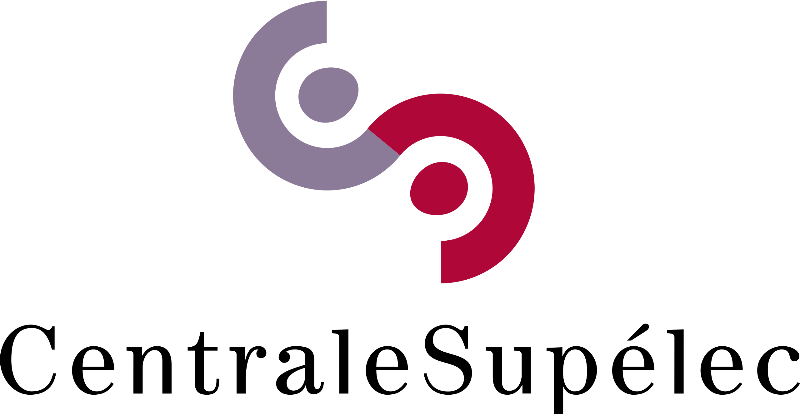
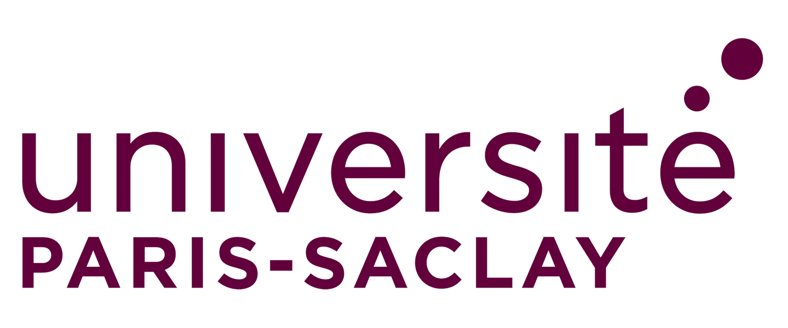

<p align="center">
  
  
  
  
</p>

# U-P3MG
The goal of the project is to optimize the hyperparameters of the P3MG algorithm using a deep learning approach.

---

### **A. Overview**
This repositorie contains the implementation of the U-P3MG model, a deep learning approach for spectroscopîc signal reconstruction in analytical chemistry. The model is designed to improve the quality of reconstitution of already established algorithm P3MG.

This repository includes tools for:
- Data preprocessing and augmentation
- Model training and evaluation
- Visualization and analysis of results

---

### **B. Getting Started**

#### **1. Clone the Repository**
```bash
git clone https://github.com/mehdikalla/U-P3MG.git
cd U-P3MG
```

#### **2. (Recommended) Install Mamba**
If Conda is not installed, use **Mambaforge** — it’s faster and fully compatible.

| Operating System | Architecture          | Installer                                                                                                                        |
| ---------------- | --------------------- | -------------------------------------------------------------------------------------------------------------------------------- |
| Linux            | x86_64 (amd64)        | [Miniforge3-Linux-x86_64.sh](https://github.com/conda-forge/miniforge/releases/latest/download/Miniforge3-Linux-x86_64.sh)       |
| macOS            | x86_64                | [Miniforge3-MacOSX-x86_64.sh](https://github.com/conda-forge/miniforge/releases/latest/download/Miniforge3-MacOSX-x86_64.sh)     |
| macOS            | arm64 (Apple Silicon) | [Miniforge3-MacOSX-arm64.sh](https://github.com/conda-forge/miniforge/releases/latest/download/Miniforge3-MacOSX-arm64.sh)       |
| Windows          | x86_64                | [Miniforge3-Windows-x86_64.exe](https://github.com/conda-forge/miniforge/releases/latest/download/Miniforge3-Windows-x86_64.exe) |

After installation, verify it works:

```bash
mamba --version
```

#### **3. Create the Environment**
@Mehdi you should create a `env.yml` file in the repository with the necessary dependencies for the project. Then, users can create the environment and use it to run the code, when you get to that point ask me to write the `env.yml` file with you.

```bash
mamba env create -f env.yml
```

#### **4. Activate the Environment**

```bash
conda activate U-P3MG
```

---

### **C. Dataset**

#### **1. Simulated Data**

---

### **D. Training and Evaluation**
@Mehdi you should provide instructions on how to train the model and evaluate its performance here.

---

#### **1. Create the Configuration File**
@Mehdi you should create a `config.yaml` file in the repository with the necessary configuration for training and evaluation. Then, users can modify the configuration file according to their needs.

```yaml
# Example configuration file for training and evaluation
training:
  batch_size: 32
  num_epochs: 100
  learning_rate: 0.001
  optimizer: "Adam"
evaluation:
  metrics: ["accuracy", "precision", "recall"]
  save_results: true
```

#### **2. Train the Model**
@Mehdi you should provide a script in the `scripts` directory that deal with GPU if available and use the configuration file for training the model. Then, users can run the training script to train the model.

```bash
./scripts/run.sh --config config.yaml --gpu 0 --train
```

#### **3. Evaluate the Model**
@Mehdi use a test flag to indicate evaluation mode.

```bash
./scripts/run.sh --config config.yaml --gpu 0 --test
```

#### **6. Run Traditional Algorithms**
@Mehdi since you have a well structed codebase, you can also provide a script to run traditional algorithms for comparison with the U-P3MG model.

```bash
./scripts/run_traditional.sh --config config.yaml
```

---

### **E. Results and Visualization**
@Mehdi you should provide instructions on how to visualize the results and analyze the performance of the model here.

#### **1. Visualize Results**


#### **2. Analyze Performance**


---

### **Licensing**

This project is licensed under the MIT License — see the [LICENSE](LICENSE) file for details.

---

### **Citation**

If you find this work useful in your research, please consider citing:

```
Coming soon...
```
